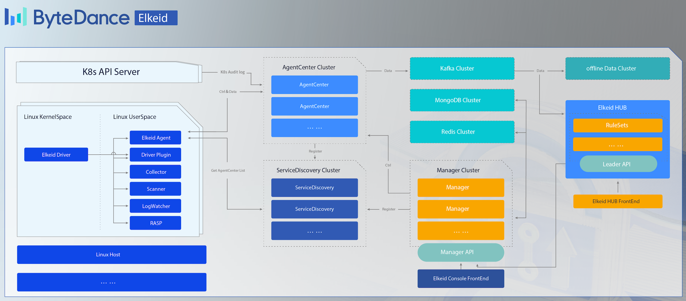
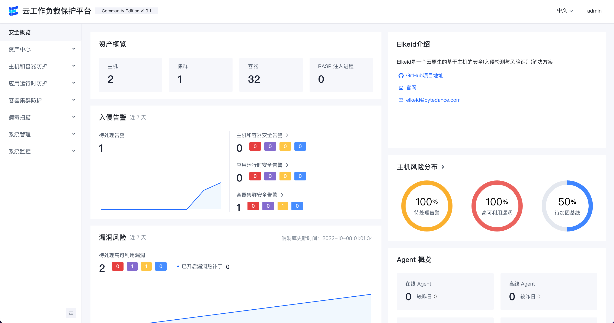
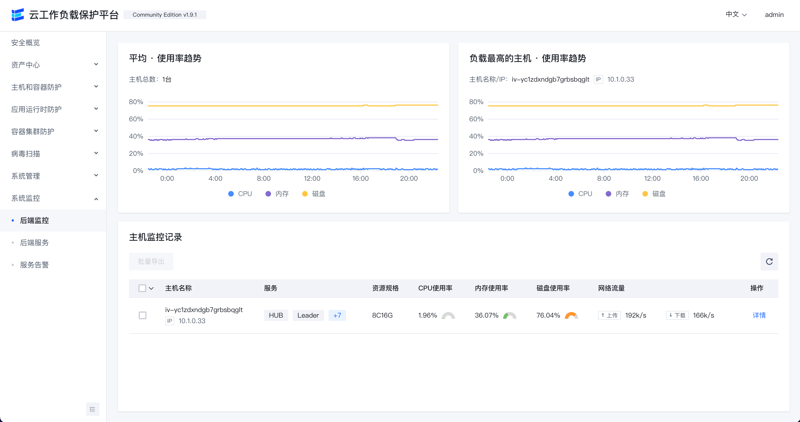

# Elkeid - バイトダンスクラウドワークロード保護プラットフォーム

[English](README.md) | [简体中文](README-zh_CN.md) | 日本語

**Elkeid** は、**ホスト、コンテナおよびK8s、サーバーレス**などのさまざまなワークロードのセキュリティ要件を満たすことができるオープンソースソリューションです。これは、バイトダンスの内部ベストプラクティスに基づいています。

企業のビジネスの発展に伴い、マルチクラウド、クラウドネイティブ、および複数のワークロードの共存の状況がますます顕著になっています。私たちは、さまざまなワークロードの下でのセキュリティ要件を満たすことができるソリューションがあることを望んでいます。そのため、**Elkeid**が誕生しました。

## はじめに

Elkeidには次の主要な機能があります：

* **Elkeid**は、ホスト層の侵入検知および悪意のあるファイルの識別のための従来の**HIDS（ホスト侵入検知システム）**の能力を持っているだけでなく、コンテナ内の悪意のある行動もよく識別できます。ホストにデプロイすることで、ホストとその上のコンテナ内の反侵入セキュリティ要件を満たすことができ、Elkeidの強力なカーネルレベルのデータ収集能力は、ほとんどのセキュリティアナリストのホストレベルデータに対する欲求を満たすことができます。

* 実行中のビジネスに対して、**Elkeid**は**RASP**機能を持ち、ビジネスプロセスに注入して反侵入保護を行うことができます。運用担当者は別のエージェントをインストールする必要がなく、ビジネスも再起動する必要がありません。

* **K8s**自体に対して、**Elkeid**は**K8s Audit Log**に接続して**K8s**システムの侵入検知とリスク識別を行うことができます。

* **Elkeid**のルールエンジン**Elkeid HUB**は、外部の複数のシステムと連携することもできます。

**Ekeid**はこれらの機能を1つのプラットフォームに統合し、さまざまなワークロードの複雑なセキュリティ要件を満たしながら、マルチコンポーネントの機能関連を実現します。さらに、各コンポーネントはバイトダンスの大量のデータと数年の実戦テストを経ています。

## Elkeidコミュニティエディションの説明

**Elkeid**の**オープンソースバージョン**と完全版には違いがあることに注意してください。現在オープンソース化されている機能は主に次のとおりです：

* すべてのオンデバイス機能、つまりオンデバイスデータ/資産/部分収集機能、カーネル状態データ収集機能、RASPプローブ部分などであり、バイトダンスの内部バージョンと一致しています。
* すべてのバックエンド機能、つまりエージェントセンター、サービスディスカバリーなどであり、バイトダンスの内部バージョンと一致しています。
* コミュニティ版のルールエンジン、つまりElkeid HUBを提供し、少数の戦略を例として使用します。
* コミュニティ版のElkeid Consoleと一部のサポート機能を提供します。

したがって、完全な反侵入およびリスク認識機能を持つには、Elkeid HUBに基づいてポリシーを構築し、Elkeidが収集したデータを二次処理する必要があります。

## Elkeidアーキテクチャ

## Elkeidホスト機能
* **[Elkeid Agent](agent)** Linuxユーザースペースエージェント、さまざまなプラグインの管理、**Elkeid Server**との通信を担当します。
* **[Elkeid Driver](driver)** ドライバーはLinuxカーネル上でデータを収集し、コンテナランタイムをサポートし、Elkeid Driverプラグインと通信します。
* **[Elkeid RASP](rasp)** CPython、Golang、JVM、NodeJS、PHPランタイムプローブをサポートし、ランタイムに動的に注入することができます。
* **Elkeidエージェントプラグインリスト**
    * [Driver Plugin](https://github.com/bytedance/Elkeid/tree/main/plugins/driver): **Elkeid Driver**の管理を担当し、ドライバーデータを処理します。
    * [Collector Plugin](https://github.com/bytedance/Elkeid/tree/main/plugins/collector): Linuxシステム上の資産/ログ情報の収集を担当し、ユーザーリスト、crontab、パッケージ情報などを収集します。
    * [Journal Watcher](https://github.com/bytedance/Elkeid/tree/main/plugins/journal_watcher): systemdログの監視を担当し、現在はssh関連のログ収集と報告をサポートしています。
    * [Scanner Plugin](https://github.com/bytedance/Elkeid/tree/main/plugins/scanner): ホスト上の悪意のあるファイルの静的検出を担当し、現在はyaraをサポートしています。
    * [RASP Plugin](https://github.com/bytedance/Elkeid/tree/main/rasp/plugin): RASPコンポーネントの管理とRASPから収集されたデータの処理を担当します。
    * [Baseline Plugin](https://github.com/bytedance/Elkeid/tree/main/plugins/baseline): ベースラインチェックポリシーに基づいてベースラインリスクを検出することを担当します。
* [**Elkeidデータ形式**](server/docs/ElkeidData.xlsx)
* [**Elkeidデータ使用チュートリアル**](elkeidup/raw_data_usage_tutorial/raw_data_usage_tutorial-zh_CN.md)

## Elkeidバックエンド機能
* **[Elkeid AgentCenter](server/agent_center)** エージェントとの通信を担当し、エージェントデータを収集して簡単に処理し、MQに集約します。また、エージェントの管理（アップグレード、構成変更、タスク配信など）も担当します。
* **[Elkeid ServiceDiscovery](server/service_discovery)** 各コンポーネントは定期的にこのコンポーネントに登録し、サービス情報を同期することで、各コンポーネントが相互に見えるようにし、直接通信を容易にします。
* **[Elkeid Manager](server/manager)** バックエンド全体の管理を担当し、関連するクエリおよび管理APIを提供します。
* **[Elkeid Console](server/web_console)** Elkeidのフロントエンド部分。
* **[Elkeid HUB](https://github.com/bytedance/Elkeid-HUB)** Elkeid HIDSルールエンジン。

## Elkeid機能リスト

| 機能リスト                                           | Elkeidコミュニティエディション | Elkeidエンタープライズエディション |
|--------------------------------------------------------|--------------------------|---------------------------|
| Linuxランタイムデータ収集                         | :white_check_mark:       | :white_check_mark:        |
| RASPプローブ                                             | :white_check_mark:       | :white_check_mark:        |
| K8s Audit Log収集                               | :white_check_mark:       | :white_check_mark:        |
| エージェント制御面                                    | :white_check_mark:       | :white_check_mark:        |
| ホストの状態と詳細                                | :white_check_mark:       | :white_check_mark:        |
| 勧誘の餌                                         | :ng_man:                 | :white_check_mark:        |
| 資産収集                                       | :white_check_mark:       | :white_check_mark:        |
| 資産収集の強化                          | :ng_man:                 | :white_check_mark:        |
| K8s資産収集                                   | :white_check_mark:       | :white_check_mark:        |
| 露出と脆弱性分析                    | :ng_man:                 | :white_check_mark:        |
| ホスト/コンテナの基本的な侵入検知               | `いくつかのサンプル`            | :white_check_mark:        |
| ホスト/コンテナの行動シーケンス侵入検知 | :ng_man:                 | :white_check_mark:        |
| RASPの基本的な侵入検知                         | `いくつかのサンプル`            | :white_check_mark:        |
| RASPの行動シーケンス侵入検知           | :ng_man:                 | :white_check_mark:        |
| K8Sの基本的な侵入検知                          | `いくつかのサンプル`            | :white_check_mark:        |
| K8Sの行動シーケンス侵入検知            | :ng_man:                 | :white_check_mark:        |
| K8S脅威分析                                    | :ng_man:                 | :white_check_mark:        |
| アラームのトレース（行動のトレース）             | :ng_man:                 | :white_check_mark:        |
| アラームのトレース（常駐のトレース）             | :ng_man:                 | :white_check_mark:        |
| アラートホワイトリスト                                        | :white_check_mark:       | :white_check_mark:        |
| 複数のアラームの集約機能                     | :ng_man:                 | :white_check_mark:        |
| 脅威対応（プロセス）                              | :ng_man:                 | :white_check_mark:        |
| 脅威対応（ネットワーク）                              | :ng_man:                 | :white_check_mark:        |
| 脅威対応（ファイル）                                 | :ng_man:                 | :white_check_mark:        |
| ファイル隔離                                         | :ng_man:                 | :white_check_mark:        |
| 脆弱性の発見                                | `いくつかの脆弱性情報`          | :white_check_mark:        |
| 脆弱性情報のホットアップデート                   | :ng_man:                 | :white_check_mark:        |
| ベースラインチェック                                         | `いくつかのベースラインルール`     | :white_check_mark:        |
| アプリケーションの脆弱性ホットフィックス                       | :ng_man:                 | :white_check_mark:        |
| ウイルススキャン                                             | :white_check_mark:       | :white_check_mark:        |
| ユーザー行動ログ分析                             | :ng_man:                 | :white_check_mark:        |
| エージェントプラグイン管理                                | :white_check_mark:       | :white_check_mark:        |
| システム監視                                      | :white_check_mark:       | :white_check_mark:        |
| システム管理                                      | :white_check_mark:       | :white_check_mark:        |
| Windowsサポート                                        | :ng_man:                 | :white_check_mark:        |
| ハニーポット                                              | :ng_man:                 | :oncoming_automobile:     |
| アクティブディフェンス                                         | :ng_man:                 | :oncoming_automobile:     |
| クラウドウイルス分析                                   | :ng_man:                 | :oncoming_automobile:     |
| ファイル整合性監視                              | :ng_man:                 | :oncoming_automobile:     |

## フロントエンド表示（コミュニティエディション）
**セキュリティ概要**

**K8sセキュリティアラートリスト**

**K8sポッドリスト**

****

**ホスト概要**

**リソースフィンガープリント**

**侵入アラート概要**

**脆弱性**

**ベースラインチェック**

**ウイルススキャン**

**バックエンドホストの監視**

**バックエンドサービスの監視**

## コンソールユーザーガイド
* **[ELkeidコンソールユーザーガイド](server/docs/console_tutorial/Elkeid_Console_manual.md)**

## クイックスタート
* **[Elkeidupによるデプロイ](elkeidup/README-zh_CN.md)**

## お問い合わせおよび協力

*Larkグループ*

## Elkeidエンタープライズエディションについて

Elkeidエンタープライズエディションは、個別の侵入検知ルール（HIDS、RASP、K8sなど）の販売、および完全な機能の販売をサポートしています。

Elkeidエンタープライズエディションに興味がある場合は、elkeid@bytedance.comまでご連絡ください。

## Elkeidドキュメント
詳細および最新の更新については、[Elkeidドキュメント](https://elkeid.bytedance.com/English/)をご覧ください。

## ライセンス
* Elkeid Driver: GPLv2
* Elkeid RASP: Apache-2.0
* Elkeid Agent: Apache-2.0
* Elkeid Server: Apache-2.0
* Elkeid Console: [Elkeidライセンス](server/web_console/LICENSE)
* Elkeid HUB: [Elkeidライセンス](https://github.com/bytedance/Elkeid-HUB/blob/main/LICENSE)

## 404StarLink 2.0 - Galaxy

Elkeidは404Teamの[404StarLink 2.0 - Galaxy](https://github.com/knownsec/404StarLink2.0-Galaxy)に参加しています。
