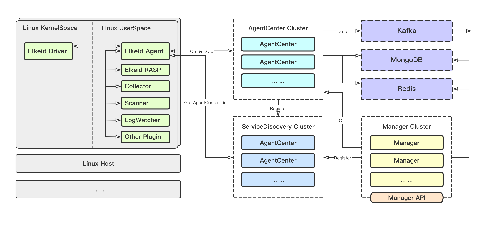
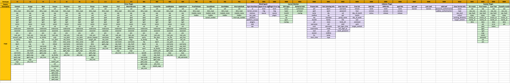

# Elkeid

*(Originated from AgentSmith-HIDS, but now it’s not just HIDS)*

[English](README.md) | 简体中文

Elkeid是一个云原生的基于主机的入侵检测解决方案。

## Elkeid Architecture

##  Elkeid Host Ability

* **[Elkeid Agent](https://github.com/bytedance/Elkeid/blob/main/agent/README-zh_CN.md)** 用户态 Agent，负责管理各个端上能力组件，与 **Elkeid Server** 通讯
* **[Elkeid Driver](https://github.com/bytedance/Elkeid/blob/main/agent/driver/README-zh_CN.md)** 在 Linux Kernel 层采集数据的组件，兼容容器环境，并能够提供Rootkit检测能力。与Elkeid Agent管理的Driver插件通讯
* **[Elkeid RASP](https://github.com/bytedance/Elkeid/tree/main/rasp)** 支持 CPython、Golang、JVM、NodeJS 的运行时数据采集探针，支持动态注入到运行时。
* **Elkeid Agent Plugin List**
  * [Driver Plugin](https://github.com/bytedance/Elkeid/blob/main/agent/driver/README-zh_CN.md): 负责与**Elkeid Driver**通信，处理其传递的数据等
  * [Collector Plugin](https://github.com/bytedance/Elkeid/blob/main/agent/collector/README-zh_CN.md): 负责端上的资产/关键信息采集工作，如用户，定时任务，包信息等等
  * [Journal Watcher](https://github.com/bytedance/Elkeid/blob/main/agent/journal_watcher/README-zh_CN.md): 负责监测systemd日志的插件，目前支持ssh相关日志采集与上报
  * [Scanner Plugin](https://github.com/bytedance/Elkeid/blob/main/agent/scanner/README-zh_CN.md): 负责在端上进行静态检测恶意文件的插件，目前支持yara
  * RASP Plugin: 负责管理RASP组件以及处理RASP采集的数据，还未开源
## [Elkeid Backend Abilty](https://github.com/bytedance/Elkeid/blob/main/server/README-zh_CN.md)
* **[Elkeid AgentCenter](https://github.com/bytedance/Elkeid/tree/main/server/agent_center)** 负责与Agent进行通信，采集Agent数据并简单处理后汇总到消息队列集群，同时也负责对Agent进行管理包括Agent的升级，配置修改，任务下发等
* **[Elkeid ServiceDiscovery](https://github.com/bytedance/Elkeid/tree/main/server/service_discovery)** 后台中的各个服务模块都需要向该组件定时注册、同步服务信息，从而保证各个服务模块中的实例相互可见，便于直接通信
* **[Elkeid Manager](https://github.com/bytedance/Elkeid/tree/main/server/manager)** 负责对整个后台进行管理，并提供相关的查询、管理接口

以上组件可以提供以下数据：

## Elkeid Advantage
当前开源模块缺少规则引擎和检测功能，还不能提供入侵检测的能力。 但是目前开源的部分可以轻松地与其他的HIDS/NIDS/XDR解决方案进行集成，或者自己对采集的数据进行数处理实现自己的需求，Elkeid 有以下主要优势：

* **性能优异**：端上能力借助Elkeid Driver与很多定制开发，性能极佳
* **为入侵检测而生**：数据采集以高强度对抗为前提，对如Kernel Rootkit，提权，无文件攻击等众多高级对抗场景均有针对性数据采集
* **支持云原生**：从端上能力到后台部署都支持云原生环境
* **百万级生产环境验证**：整体经过内部百万级验证，从端到Server，稳定性与性能经过考验，Elkeid不仅仅是一个PoC，是生产级的；开源版本即内部Release Version
* **二次开发友好**：Elkeid 方便二次开发与定制化需求增加

## Quick Start
* **[Quick Start](server/docs/quick-start-zh_CN.md)**
* **[Deploy Question and Answer](server/docs/qa-zh_CN.md)**

## Contact us && Cooperation

*Lark Group*

## License
* Elkeid Driver: GPLv2
* Elkeid RASP: Apache-2.0
* Elkeid Agent: Apache-2.0
* Elkeid Server: Apache-2.0

## 404StarLink 2.0 - Galaxy

同时，Elkeid 也是 404Team [星链计划2.0](https://github.com/knownsec/404StarLink2.0-Galaxy)中的一环，如果对星链计划感兴趣的小伙伴可以点击下方链接了解。
[https://github.com/knownsec/404StarLink2.0-Galaxy](https://github.com/knownsec/404StarLink2.0-Galaxy)
