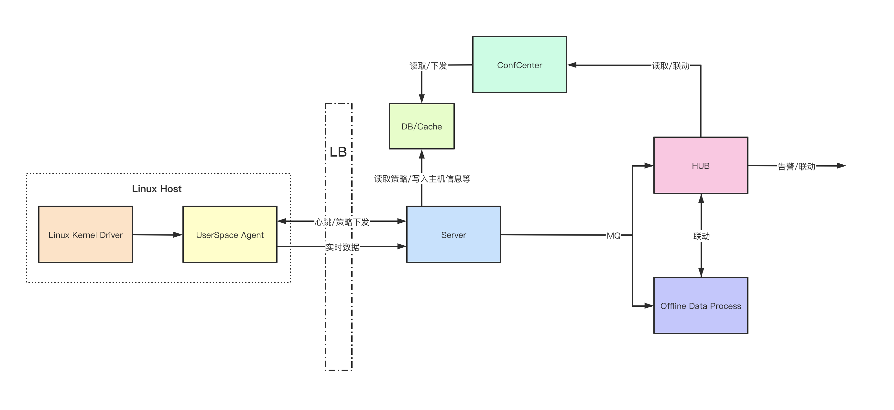

# AgentSmith-HIDS

English | [简体中文](README-zh_CN.md)

AgentSmith-HIDS is a Cloud-Native Host-Based Intrusion Detection solution project to provide next-generation Threat Detection and Behavior Audition with modern architecture. 

AgentSmith-HIDS comprises three major components：
* AgentSmith-HIDS Agent, co-worked with AgentSmith-HIDS Driver, is the game-changer for the Data Collection market. It worked at both Kernel and User Space of Linux System, providing rich data flow with much better performance. 
* AgentSmith-HIDS Server provides Service-Discovery for the production environment of up to millions of agents. The Server also supports primary data formatting along with rules distribution for the Agent. 
* AgentSmith-Hub provides high-performance, lightweight, and stateless alert generation with data manipulation to analyze the rich data flow. 

Now we are more than happy to announce the open-source of AgentSmith-HIDS Agent and AgentSmith-HIDS Driver. We decided to strengthen the Defense Community with our game-changing technology. Due to the lack of rule engine and detection functions, AgentSmith-HIDS Agent and Driver doesn't provide all HIDS capability on its own. However, it is a tremendous Host-Information-Collect-Agent that could be easily integrated with current HIDS/NIDS/XDR solutions on the market. AgentSmith-HIDS Agent and AgentSmith-HIDS Driver together advance solutions on the market in four major areas.

* **Better performance**  Data/Information are collected in kernel space to avoid additional supplement actions such as traversal of '/proc' directory or collecting from other audition processes such as "auditd".
* **Hard to be bypassed**  A specifically designed kernel driver powers data/Information collection, making it virtually impossible for malicious software, like rootkit, to evade detection or audition. The Driver could capture even evasion behavior itself.
* **Kernel + User Space**  AgentSmith-HIDS Agent provides User Space detection abilities, including file audition, in-house rule detection, and primary whitelists. 
* **Easy to be integrated**  AgentSmith-HIDS could empower any User Space agents far beyond Host Intrusion usages with the detailed and reliable data flow. A wide user action audition could benefit both Behavior Analysis and Compliance requests. When integrated with NIDS, security analyzers could build a comprehensive Provenance Graph from the network connections, along with high traceable process trees and file auditions.

## System Architecture

Currently, we are only open-sourcing AgentSmith-HIDS Agent && Driver. Both components have been deployed and tested in production environments for months. We welcome any suggestions and cooperation.

* #### [AgentSmith-Driver](https://github.com/bytedance/AgentSmith-HIDS/tree/main/driver)
* #### [AgentSmith-Agent](https://github.com/bytedance/AgentSmith-HIDS/tree/main/agent)

## To be Continued 
* AgentSmith-Server is under development. More Features are on the way.
