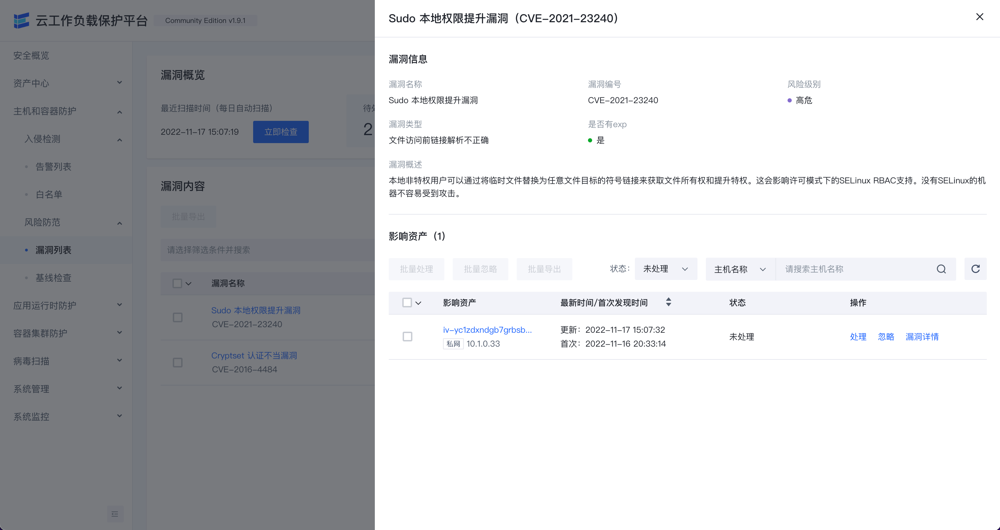
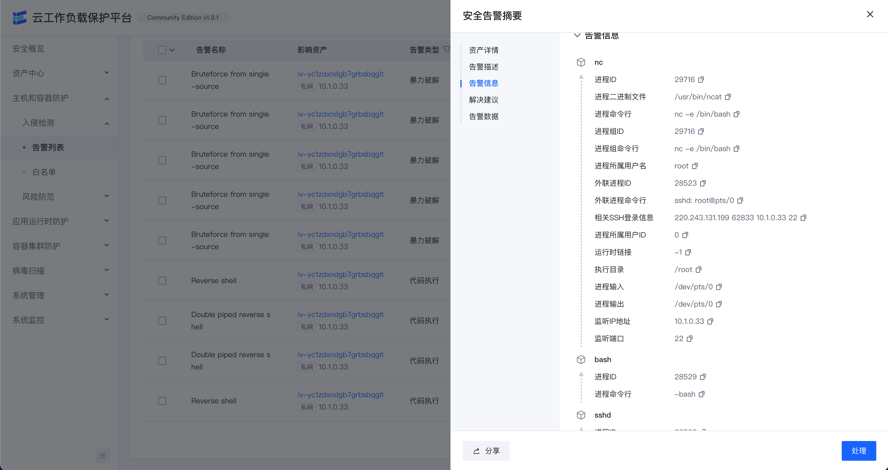

# Elkeid

*(Originated from AgentSmith-HIDS, but now it’s not just HIDS)*

English | [简体中文](README-zh_CN.md)

Elkeid is a support cloud-native and base linux host security(Intrusion detection and risk identification) solution.

## Elkeid Architecture

##  Elkeid Host Ability

* **[Elkeid Agent](agent)** Linux userspace agent，responsible for managing various plugin,communication with **Elkeid Server**.
* **[Elkeid Driver](driver)** Driver can collect data on Linux Kernel, support container environment, communication with Elkeid Driver Plugin.
* **[Elkeid RASP](rasp)** Support CPython、Golang、JVM、NodeJS runtime data probe, supports dynamic injection into the runtime.
* **Elkeid Agent Plugin List**
    * [Driver Plugin](https://github.com/bytedance/Elkeid/tree/main/plugins/driver): Responsible for managing **Elkeid Driver**, and process the driver data.
    * [Collector Plugin](https://github.com/bytedance/Elkeid/tree/main/plugins/collector): Responsible for the collection of assets/log information on the Linux System, such as user list, crontab, package information, etc.
    * [Journal Watcher](https://github.com/bytedance/Elkeid/tree/main/plugins/journal_watcher): Responsible for monitoring systemd logs, currently supports ssh related log collection and reporting.
    * [Scanner Plugin](https://github.com/bytedance/Elkeid/tree/main/plugins/scanner): Responsible for static detection of malicious files on the host, currently supports yara.
    * [RASP Plugin](https://github.com/bytedance/Elkeid/tree/main/rasp/plugin): Responsible for managing RASP components and processing data collected from RASP.
    * [Baseline Plugin](https://github.com/bytedance/Elkeid/tree/main/plugins/baseline): Responsible for detecting baseline risks based on baseline check policies.

The above components can provide these data:

Driver Data

Other Data

## Elkeid Backend Ability
* **[Elkeid AgentCenter](server/agent_center)** Responsible for communicating with the Agent, collecting Agent data and simply processing it and then summing it into the MQ, is also responsible for the management of the Agent, including Agent upgrade, configuration modification, task distribution, etc.
* **[Elkeid ServiceDiscovery](server/service_discovery)** Each component in the background needs to register and synchronize service information with the component regularly, so as to ensure that the instances in each service module are visible to each other and facilitate direct communication.
* **[Elkeid Manager](server/manager)** Responsible for the management of the entire backend, and provide related query and management API.
* **[Elkeid Console](server/web_console)** Elkeid Front-end
* **[Elkeid HUB](https://github.com/bytedance/Elkeid-HUB)** Elkeid HIDS RuleEngine

## Elkeid Advantage

* **Excellent Performance**: With the help of Elkeid Driver and many custom developments, the end-to-end capability is excellent
* **Born For Intrusion Detection**: Data collection is based on high-intensity confrontation, and targeted data collection is available for many advanced confrontation scenarios such as Kernel Rootkit, privilege escalation, and fileless attacks.
* **Support Cloud Native**: Cloud native environment is supported from end-to-end capabilities to back-end deployment.
* **One-million-level Production Environment Verification**: The whole has been internally verified at a million-level, and the stability and performance have been tested from end to server. Elkeid is not just a PoC, it is production-level; the open source version is the internal Release Version.
* **Secondary Development Friendly**: Elkeid facilitates secondary development and increased demand for customization.

## Front-end Display (Community Edition)
* Host Details
  
* Asset Details
  
* Alarm Details
  
* Allow List Management
  
* Agent/Plugin Management
  
* User Management
  

## Quick Start
* **[Deploy by Elkeidup](elkeidup/README.md)**

## Contact us && Cooperation

*Lark Group*

If interested in Elkeid Enterprise Edition please contact elkeid@bytedance.com

## License
* Elkeid Driver: GPLv2
* Elkeid RASP: Apache-2.0
* Elkeid Agent: Apache-2.0
* Elkeid Server: Apache-2.0
* Elkeid Console: [Elkeid License](server/web_console/LICENSE)

## 404StarLink 2.0 - Galaxy

Elkeid has joined 404Team [404StarLink 2.0 - Galaxy](https://github.com/knownsec/404StarLink2.0-Galaxy)
