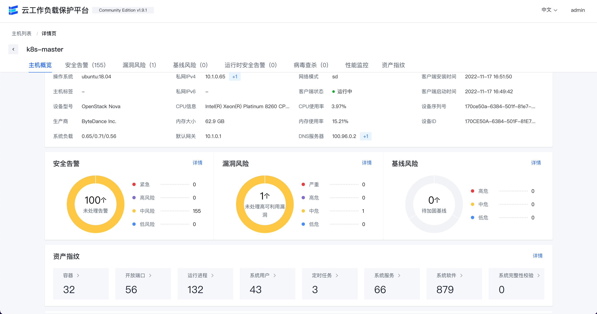

# Elkeid - Bytedance Cloud Workload Protection Platform

English | [简体中文](README-zh_CN.md)

**Elkeid** is an open source solution that can meet the security requirements of various workloads such as **hosts, containers and K8s, and serverless**. It is derived from ByteDance's internal best practices.

With the business development of enterprises, the situation of multi-cloud, cloud-native, and coexistence of multiple workloads has become more and more prominent. We hope that there can be a set of solutions that can meet the security requirements under different workloads, so **Elkeid** was born.

## Introduction

Elkeid has the following key capabilities:

* **Elkeid** not only has the traditional **HIDS (Host Intrusion Detection System)** ability for host layer intrusion detection and malicious file identification, but also can well identify malicious behaviors in containers. The host can meet the anti-intrusion security requirements of the host and the container on it, and the powerful kernel-level data collection capability at the bottom of Elkeid can satisfy the desire of most security analyst for host-level data.

* For the running business **Elkeid** has the **RASP** capability and can be injected into the business process for anti-intrusion protection, not only the operation and maintenance personnel do not need to install another Agent, but also the business does not need to restart.

* For **K8s** itself, **Elkeid** supports collection to **K8s Audit Log** to perform intrusion detection and risk identification on the **K8s** system.

* **Elkeid**'s rule engine **Elkeid HUB** can also be well linked with external multiple systems.

**Ekeid** integrates these capabilities into one platform to meet the complex security requirements of different workloads, while also achieving multi-component capability association. What is even more rare is that each component undergoes massive byte-beating. Data and years of combat testing.

## Elkeid Community Edition Description

It should be noted that there are differences between the **Elkeid** **open source version** and the full version. The current open source capabilities mainly include:

* All on-device capabilities, that is, on-device data/asset/partial collection capabilities, kernel-state data collection capabilities, RASP probe parts, etc., and are consistent with the internal version of ByteDance;
* All backend capabilities, namely Agent Center, service discovery, etc., are consistent with the internal version of ByteDance;
* Provide a community edition rule engine, namely Elkeid HUB, and use it as an example with a small number of strategies;
* Provides community version of Elkeid Console and some supporting capabilities.

Therefore, it is necessary to have complete anti-intrusion and risk perception capabilities, and it is also necessary to construct policies based on Elkeid HUB and perform secondary processing of the data collected by Elkeid.

## Elkeid Architecture

##  Elkeid Host Ability
* **[Elkeid Agent](agent)** Linux userspace agent，responsible for managing various plugin, communication with **Elkeid Server**.
* **[Elkeid Driver](driver)** Driver can collect data on Linux Kernel, support container runtime , communication with Elkeid Driver Plugin.
* **[Elkeid RASP](rasp)** Support CPython、Golang、JVM、NodeJS、PHP runtime probe, supports dynamic injection into the runtime.
* **Elkeid Agent Plugin List**
    * [Driver Plugin](https://github.com/bytedance/Elkeid/tree/main/plugins/driver): Responsible for managing **Elkeid Driver**, and process the driver data.
    * [Collector Plugin](https://github.com/bytedance/Elkeid/tree/main/plugins/collector): Responsible for the collection of assets/log information on the Linux System, such as user list, crontab, package information, etc.
    * [Journal Watcher](https://github.com/bytedance/Elkeid/tree/main/plugins/journal_watcher): Responsible for monitoring systemd logs, currently supports ssh related log collection and reporting.
    * [Scanner Plugin](https://github.com/bytedance/Elkeid/tree/main/plugins/scanner): Responsible for static detection of malicious files on the host, currently supports yara.
    * [RASP Plugin](https://github.com/bytedance/Elkeid/tree/main/rasp/plugin): Responsible for managing RASP components and processing data collected from RASP.
    * [Baseline Plugin](https://github.com/bytedance/Elkeid/tree/main/plugins/baseline): Responsible for detecting baseline risks based on baseline check policies.
* [**Elkeid Data Format**](server/docs/ElkeidData.xlsx)
* [**Elkeid Data Usage Tutorial**](elkeidup/raw_data_usage_tutorial/raw_data_usage_tutorial-zh_CN.md)

## Elkeid Backend Ability
* **[Elkeid AgentCenter](server/agent_center)** Responsible for communicating with the Agent, collecting Agent data and simply processing it and then summing it into the MQ, is also responsible for the management of the Agent, including Agent upgrade, configuration modification, task distribution, etc.
* **[Elkeid ServiceDiscovery](server/service_discovery)** Each component in the background needs to register and synchronize service information with the component regularly, so as to ensure that the instances in each service module are visible to each other and facilitate direct communication.
* **[Elkeid Manager](server/manager)** Responsible for the management of the entire backend, and provide related query and management API.
* **[Elkeid Console](server/web_console)** Elkeid Front-end
* **[Elkeid HUB](https://github.com/bytedance/Elkeid-HUB)** Elkeid HIDS RuleEngine

## Elkeid Function List

| Ability List                                           | Elkeid Community Edition | Elkeid Enterprise Edition |
|--------------------------------------------------------|--------------------------|---------------------------|
| Linux  runtime data collection                         | :white_check_mark:       | :white_check_mark:        |
| RASP probe                                             | :white_check_mark:       | :white_check_mark:        |
| K8s Audit Log collection                               | :white_check_mark:       | :white_check_mark:        |
| Agent control plane                                    | :white_check_mark:       | :white_check_mark:        |
| Host Status and Details                                | :white_check_mark:       | :white_check_mark:        |
| Extortion bait                                         | :ng_man:                 | :white_check_mark:        |
| Asset collection                                       | :white_check_mark:       | :white_check_mark:        |
| Asset Collection Enhancements                          | :ng_man:                 | :white_check_mark:        |
| K8s asset collection                                   | :white_check_mark:       | :white_check_mark:        |
| Exposure and Vulnerability Analysis                    | :ng_man:                 | :white_check_mark:        |
| Host/Container Basic Intrusion Detection               | `few samples`            | :white_check_mark:        |
| Host/Container Behavioral Sequence Intrusion Detection | :ng_man:                 | :white_check_mark:        |
| RASP Basic Intrusion Detection                         | `few samples`            | :white_check_mark:        |
| RASP Behavioral Sequence Intrusion Detection           | :ng_man:                 | :white_check_mark:        |
| K8S Basic Intrusion Detection                          | `few samples`            | :white_check_mark:        |
| K8S Behavioral Sequence Intrusion Detection            | :ng_man:                 | :white_check_mark:        |
| K8S Threat Analysis                                    | :ng_man:                 | :white_check_mark:        |
| Alarm traceability (behavior traceability)             | :ng_man:                 | :white_check_mark:        |
| Alarm traceability (resident traceability)             | :ng_man:                 | :white_check_mark:        |
| Alert Whitelist                                        | :white_check_mark:       | :white_check_mark:        |
| Multi-alarm aggregation capability                     | :ng_man:                 | :white_check_mark:        |
| Threat Repsonse (Process)                              | :ng_man:                 | :white_check_mark:        |
| Threat Repsonse (Network)                              | :ng_man:                 | :white_check_mark:        |
| Threat Repsonse (File)                                 | :ng_man:                 | :white_check_mark:        |
| File isolation                                         | :ng_man:                 | :white_check_mark:        |
| Vulnerability discovery                                | `few vuln info`          | :white_check_mark:        |
| Vulnerability information hot update                   | :ng_man:                 | :white_check_mark:        |
| Baseline check                                         | `few baseline rules`     | :white_check_mark:        |
| Application Vulnerability Hotfix                       | :ng_man:                 | :white_check_mark:        |
| Virus scan                                             | :white_check_mark:       | :white_check_mark:        |
| User behavior log analysis                             | :ng_man:                 | :white_check_mark:        |
| Agent Plugin management                                | :white_check_mark:       | :white_check_mark:        |
| System monitoring                                      | :white_check_mark:       | :white_check_mark:        |
| System Management                                      | :white_check_mark:       | :white_check_mark:        |
| Windows Support                                        | :ng_man:                 | :white_check_mark:        |
| Honey pot                                              | :ng_man:                 | :oncoming_automobile:     |
| Active defense                                         | :ng_man:                 | :oncoming_automobile:     |
| Cloud virus analysis                                   | :ng_man:                 | :oncoming_automobile:     |
| File-integrity monitoring                              | :ng_man:                 | :oncoming_automobile:     |

## Front-end Display (Community Edition)
**Security overview**

**K8s security alert list**

**K8s pod list**

****

**Host overview**

**Resource fingerprint**

**intrusion alert overwiew**

**Vulnerability**

**Baseline check**

**Virus scan**

**Backend hosts monitoring**

**Backend service monitoring**

## Console User Guide
* **[ELkeid Console User Guide](server/docs/console_tutorial/Elkeid_Console_manual.md)**

## Quick Start
* **[Deploy by Elkeidup](elkeidup/README.md)**

## Contact us && Cooperation

*Lark Group*

## About Elkeid Enterprise Edition

Elkeid Enterprise Edition supports separate intrusion detection rules(like the HIDS, RASP, K8s) sales, as well as full capacity sales.

If interested in Elkeid Enterprise Edition please contact elkeid@bytedance.com

## Elkeid Docs
For more details and latest updates, see [Elkeid docs](https://elkeid.bytedance.com/English/).

## License
* Elkeid Driver: GPLv2
* Elkeid RASP: Apache-2.0
* Elkeid Agent: Apache-2.0
* Elkeid Server: Apache-2.0
* Elkeid Console: [Elkeid License](server/web_console/LICENSE)

## 404StarLink 2.0 - Galaxy

Elkeid has joined 404Team [404StarLink 2.0 - Galaxy](https://github.com/knownsec/404StarLink2.0-Galaxy)
