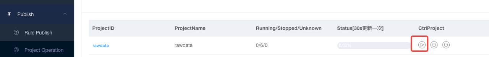
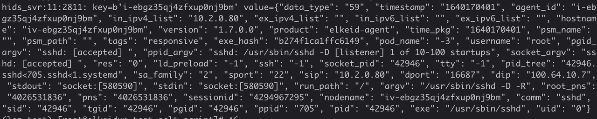

## Elkeid 原始数据接入指南

### 适用版本

Elkeid 社区版v1.9.1

### 综述

Elkeid为了优化数据流压力和追求数据流灵活性，选用PB格式来传递数据。PB在kafka中存储为 `byte[]` 形式的消息，因此在消费数据后需要按照protobuf的形式进行解压，否则看到将是乱码字段。因此对于一般情况下使用来说，转移成JSON 数据流会更符合大数据套件的数据接入情况。这里提供接受Elkeid数据流并转换成JSON数据流的两种样例，供使用者参考。

### PB Schema

如下即为 HIDS的 PB的protobuf schema，需要注意的是Item类为了灵活的支持多种版本的数据更新，Map中通过K-V的方式包含了基本全部类型的数据格式。因此单独PB后需要针对Map遍历提取K-V对放入全体数据后才能较好的支持进入大数据套件。

```
syntax = "proto3";
option go_package = "hids_pb";
package hids_pb;

//server -> bmq
message MQData{
  int32 data_type = 1;
  int64 timestamp = 2;
  Item body = 3;

  string agent_id = 4;
  string in_ipv4_list = 5;
  string ex_ipv4_list = 6;
  string in_ipv6_list = 7;
  string ex_ipv6_list = 8;
  string hostname = 9;
  string version = 10;
  string product = 11;

  int64  time_pkg = 12;
  string psm_name = 13;
  string psm_path = 14;
  string tags = 15;
}

message Item{
  map<string,string> fields = 1;
}
```
[MQData.proto](https://github.com/bytedance/Elkeid/blob/v1.9.1/server/docs/MQData.proto)

> Map内的数据字段请参考 [Elkeid数据说明](../raw_data_desc.md)


### 简便方式（Elkeid-HUB）

Elkeid原生自带基于golang的PB数据解析，因此可以通过利用[Elkeid-HUB](../../hub/quick_start/quick_start.md)进行数据的解压和ETL操作。

#### 配置输出端

首先找到对应的输出端，Elkeid原生支持将PB的数据流转换成JSON并以ES/Kafka等方式进行输出，此处以kafka为例，填入所需的Kafka Bootstrap Server 地址（含端口）和topic名即可。此处建议打开AddTimestamp追加输出HUB的时间（将Unix系统时间转换成时间戳格式）


#### 配置Project

在project中新增project，并按如下新增到Kafka的输出。注意OUTPUT后的值要和上面配置输出端的OutputID 保持一致。配之后点击Confirm 保存

```
INPUT.hids --> OUTPUT.your_kafka
```


#### 启动

点击 Rule Publish 提交更改。等待任务完成后点击Project Operation 将任务启动即可。之后即可在所配制的Kafka topic中看到JSON格式的数据字段





> 注意如果用户希望直接将HIDS数据写入ES，请参考上述 *Elkeid HUB 配置*
> 
> 如果用户利用Logstash进行日志采集，可以参考[Logstash Protobuf Plugin](https://www.elastic.co/guide/en/logstash/current/plugins-codecs-protobuf.html#plugins-codecs-protobuf)进行配置。

### Consumer 样例

这里以Python Kafka 套件消费数据为主进行展示

> 需要 kafka-python  和 protobuf 两个 python3 lib

#### 安装protoc

首先需要安装protobuf的 compiler，主要用于生成 `MQData_pb2.py` 这个文件。**用户可以使用我们直接提供的文件，或者自行编译**。这里以 linux 为例，执行下面语句即可安装3.14的 protoc

```
PROTOC_ZIP=protoc-3.14.0-linux-x86_64.zip
curl -OL https://github.com/protocolbuffers/protobuf/releases/download/v3.14.0/$PROTOC_ZIP
sudo unzip -o $PROTOC_ZIP -d /usr/local bin/protoc
sudo unzip -o $PROTOC_ZIP -d /usr/local 'include/*'
rm -f $PROTOC_ZIP
```
将上面的PB Schema进行编译

```
protoc -I=. --python_out=. ./MQData.proto
```
会生成 `MQData_pb2.py` 文件，将这个文件放到您的项目中。

[MQData_pb2.py](https://github.com/bytedance/Elkeid/blob/v1.9.1/server/docs/MQData_pb2.py)

#### 编写consumer

因为Elkeid PB 将主要数据放入 `body.field` 这个map中，因此需要对数据进行拍平，生成原生的一级数据结构。这里提供一个 decoder 供Kafka Serializer使用

```
#!/usr/bin/python3

# decoder of Elkeid PB, input string and will dump json for you.
def pbDecoder(value):
    ret = {}
    aMQData = MQData.MQData();
    aMQData.ParseFromString(value)

    # common part of message
    ret["data_type"] = str(aMQData.data_type)
    ret["timestamp"] = str(aMQData.timestamp)
    ret["agent_id"] = aMQData.agent_id
    ret["in_ipv4_list"] = aMQData.in_ipv4_list
    ret["ex_ipv4_list"] = aMQData.ex_ipv4_list
    ret["in_ipv6_list"] = aMQData.in_ipv6_list
    ret["ex_ipv6_list"] = aMQData.ex_ipv6_list
    ret["hostname"] = aMQData.hostname
    ret["version"] = aMQData.version
    ret["product"] = aMQData.product
    ret["time_pkg"] = str(aMQData.time_pkg)
    ret["psm_name"] = aMQData.psm_name
    ret["psm_path"] = aMQData.psm_path
    ret["tags"] = aMQData.tags

    # major data part of message
    for key in aMQData.body.fields:
        ret[key] =  aMQData.body.fields[key]
    
    return json.dumps(ret)
```

然后创建 Kafka consumer，将上述的decoder作为 `kafka` 的 `value_deserializer` 传递进去。Elkeid的默认topic为 `hids_svr`

```
#!/usr/bin/python3
from kafka import KafkaConsumer
import MQData_pb2 as MQData # 刚刚编译的那个class文件
import json

# decoder of Elkeid PB, input string and will dump json for you.
def pbDecoder(value):
    ret = {}
    aMQData = MQData.MQData();
    aMQData.ParseFromString(value)

    # common part of message
    ret["data_type"] = str(aMQData.data_type)
    ret["timestamp"] = str(aMQData.timestamp)
    ret["agent_id"] = aMQData.agent_id
    ret["in_ipv4_list"] = aMQData.in_ipv4_list
    ret["ex_ipv4_list"] = aMQData.ex_ipv4_list
    ret["in_ipv6_list"] = aMQData.in_ipv6_list
    ret["ex_ipv6_list"] = aMQData.ex_ipv6_list
    ret["hostname"] = aMQData.hostname
    ret["version"] = aMQData.version
    ret["product"] = aMQData.product
    ret["time_pkg"] = str(aMQData.time_pkg)
    ret["psm_name"] = aMQData.psm_name
    ret["psm_path"] = aMQData.psm_path
    ret["tags"] = aMQData.tags

    # major data part of message
    for key in aMQData.body.fields:
        ret[key] =  aMQData.body.fields[key]
    
    return json.dumps(ret)


# To consume latest messages and auto-commit offsets
consumer = KafkaConsumer('hids_svr',
                         group_id='test',
                         auto_offset_reset='latest',
                         bootstrap_servers=['10.2.0.67:9092', '10.2.0.233:9092', '10.2.0.92:9092'],
                         value_deserializer = lambda m: pbDecoder(m))

# Print all message in JSON format
# this is the part that you need to code to your job
for message in consumer:
    # do something with message.value
    print ("%s:%d:%d: key=%s value=%s" % (message.topic, message.partition,
                                          message.offset, message.key,
                                          message.value))
```


### 数据持久化建议

#### 整体建议

数据在获取到Json格式后即可根据[Elkeid 数据说明](../raw_data_desc.md) 的字段进行相应的存储工作。一般情况对于HIDS数据持久化存储需求应该符合使用方公司自身的数据中台规范需求。这里仅仅提供建议，而没有标准化方法可以直接使用。

#### 大宽表

对于机器数量少于1w台的情况，我们建议用户将Elkeid数据以大宽表的形式存储。也就是说将所有数据用共同的表schema进行存储。我们建议用户将Elkeid数据按照时间进行分区，方便后续进行过期（TTL）设置。

建表DDL请参考如下：

```
CREATE TABLE `YOUR_DBNAME`.`hids_rawdata`(
    `agent_id` STRING COMMENT 'HIDS 的 agent_id',
    `argv` STRING COMMENT '进程命令行',
    `comm` STRING COMMENT '进程命令行首项',
    `data_type` STRING COMMENT '数据类型',
    `dip` STRING COMMENT '链接目的IP',
    `dport` STRING COMMENT '链接目的端口',
    `exe` STRING COMMENT '命令首项的文件路径',
    `exe_hash` STRING COMMENT '命令首项的文件哈希',
    `hostname` STRING COMMENT '主机名',
    `ld_preload` STRING COMMENT '执行时加载的额外so文件',
    `nodename` STRING COMMENT '节点名',
    `pgid` STRING COMMENT '进程组ID',
    `pid` STRING COMMENT '进程ID',
    `pid_tree` STRING COMMENT '进程链条',
    `ppid` STRING COMMENT '父进程ID',
    `run_path` STRING COMMENT '命令执行时所在的位置',
    `res` STRING COMMENT '返回值',
    `sa_family` STRING COMMENT '链接的协议组',
    `sessionid` STRING COMMENT 'linux进程会话ID',
    `sip` STRING COMMENT '链接源IP',
    `socket_pid` STRING COMMENT '进程链上存在socket的进程ID',
    `sport` STRING COMMENT '链接源端口',
    `ssh` STRING COMMENT '进程创建时的SSH环境变量信息',
    `stdin` STRING COMMENT '标准输入',
    `stdout` STRING COMMENT '标准输出',
    `tgid` STRING COMMENT '线程组ID',
    `time` STRING COMMENT '进程发生时间',
    `tty` STRING COMMENT 'tty字符终端',
    `uid` STRING COMMENT 'linux上用户ID',
    `username` STRING COMMENT 'linux上用户名',
    `query` STRING COMMENT 'DNS 查询语句',
    `qr` STRING COMMENT 'DNS 查询qr',
    `opcode` STRING COMMENT 'DNS 查询opcode',
    `rcode` STRING COMMENT 'DNS 查询rcode',
    `file_path` STRING COMMENT '创建文件路径',
    `ptrace_request` STRING COMMENT 'ptrace时的请求ID',
    `target_pid` STRING COMMENT 'ptrace时被调试进程ID',
    `lkm_file` STRING COMMENT '内核模块名（老）',
    `old_uid` STRING COMMENT '提权前linux用户ID',
    `module_name` STRING COMMENT '内核模块名',
    `hidden` STRING COMMENT '是否为隐藏内核模块',
    `syscall_number` STRING COMMENT '被Hook的syscall ID',
    `interrupt_number` STRING COMMENT '被Hook的中断 ID',
    `data` STRING COMMENT '数据（某些场景使用）',
    `socket_argv` STRING COMMENT '进程链上存在socket的进程命令行',
    `ppid_argv` STRING COMMENT '父进程命令行',
    `pgid_argv` STRING COMMENT '进程组长命令行',
    `connect_type` STRING COMMENT '链接的类型',
    `oldname` STRING COMMENT '原用户名',
    `newname` STRING COMMENT '新用户名',
    `mprotect_prot` STRING COMMENT 'mprotect_prot',
    `owner_pid` STRING COMMENT 'owner_pid',
    `owner_file` STRING COMMENT 'owner_file',
    `vm_file` STRING COMMENT 'vm_file',
    `status` STRING COMMENT 'ssh登陆状态',
    `types` STRING COMMENT 'ssh登陆类型',
    `invalid` STRING COMMENT 'ssh用户是否存在',
    `rawlog` STRING COMMENT 'ssh登陆日志',
    `authorized` STRING COMMENT 'kerberos登陆的linux用户名',
    `principal` STRING COMMENT 'kerberos登陆的kerb用户名',
    `user` STRING COMMENT 'ssh登陆的linux用户名',
    `ex_ipv4_list` STRING COMMENT '外网IPv4列表',
    `ex_ipv6_list` STRING COMMENT '外网IPv6列表',
    `in_ipv4_list` STRING COMMENT '内网IPv4列表',
    `in_ipv6_list` STRING COMMENT '内网IPv6列表',
    `version` STRING COMMENT 'HIDS版本号',
    `sid` STRING COMMENT '进程会话sid',
    `addr` STRING COMMENT 'addr',
    `target_argv` STRING COMMENT 'ptrace被调试进程的argv',
    `old_username` STRING COMMENT '提权前用户名',
    `lkm_hash` STRING COMMENT '内核模块哈希 ',
    `timestamp` STRING COMMENT '时间戳',
    `time_pkg` STRING COMMENT '上传时间',
    `tags` STRING COMMENT '机器标签',
    `ko_file` STRING COMMENT '新增内核模块名',
    `flags` STRING COMMENT 'memfd - flags',
    `fdname` STRING COMMENT 'memfd - flags',
    `new_name` STRING COMMENT 'mv/link/prctl 新文件名',
    `old_name` STRING COMMENT 'mv/link 旧文件名',
    `option` STRING COMMENT 'prctl',
    `pns` STRING COMMENT 'pid_namespace',
    `root_pns` STRING COMMENT 'root fs pid_namespace',
    `psm` STRING COMMENT 'pod psm',
    `pod_name` STRING COMMENT 'pod name',
    `sandbox_task_id` STRING COMMENT '沙箱任务id（含蜜罐）',
    `sandbox_task_type` STRING COMMENT '沙箱类型（含蜜罐）',
    `cpu` STRING COMMENT 'CPU Heartbeat',
    `io` STRING COMMENT 'IO Heartbeat',
    `kernel_version` STRING COMMENT 'kernel_version -- heartbeat',
    `memory` STRING COMMENT 'memory -- heartbeat',
    `net_type` STRING COMMENT 'net_type -- heartbeat',
    `platform` STRING COMMENT 'platform  -- heartbeat',
    `platform_version` STRING COMMENT 'platform_version -- heartbeat',
    `plugins` STRING COMMENT 'plugins  -- heartbeat',
    `slab` STRING COMMENT 'slab  -- heartbeat',
    `exe_size` STRING COMMENT 'exe 大小，静态检测',
    `psm_name` STRING COMMENT 'psm_name',
    `psm_path` STRING COMMENT 'psm_path',
    `product` STRING COMMENT '产品类型',
    `mode` STRING COMMENT 'mode ',
    `file` STRING COMMENT 'file ',
    `sec` STRING COMMENT 'sec ',
    `nsec` STRING COMMENT 'nsec ',
    `sig` STRING COMMENT 'sig',
    `dev` STRING COMMENT 'dev',
    `fstype` STRING COMMENT 'fstype',
    `wait` STRING COMMENT 'wait',
    `sb_id` STRING COMMENT 'sb_id',
    `manufacturer` STRING COMMENT 'manufacturer',
    `serial` STRING COMMENT 'serial',
    `action` STRING COMMENT 'action',
    `dpid` STRING COMMENT 'dpid',
    `dpid_argv` STRING COMMENT 'dpid_argv',
    `cred` STRING COMMENT 'cred',
    `dcred` STRING COMMENT 'dcred',
    `name` STRING COMMENT 'name',
    `idc` STRING COMMENT 'idc',
    `platform_family` STRING COMMENT 'platform_family',
    `net_mode` STRING COMMENT 'net mode ',
    `boot_at` STRING COMMENT 'boot_at',
    `started_at` STRING COMMENT 'started_at'
) COMMENT '全量数据' PARTITIONED BY (
    `date` STRING COMMENT 'date', 
    `hour` STRING COMMENT 'hour'
) ROW FORMAT SERDE 'org.apache.hadoop.hive.ql.io.parquet.serde.ParquetHiveSerDe' WITH SERDEPROPERTIES ('serialization.format' = '1') STORED AS INPUTFORMAT 'org.apache.hadoop.hive.ql.io.parquet.MapredParquetInputFormat' OUTPUTFORMAT 'org.apache.hadoop.hive.ql.io.parquet.MapredParquetOutputFormat' TBLPROPERTIES (
    'transient_lastDdlTime' = '1649647413',
    'primary_key' = ''
)
```


> 这里需要注意的是，Elkeid数据中并不存在直接的date / hour字段
> 因此可以先对Elkeid数据所在HDFS分区进行外表建立
> 然后从外表将数据导入内表分区时手动设置partition
>  1. ALTER TABLE  hids_rawdata ADD PARTITION (date='2008-08-08', hour='08')
>  2. LOAD DATA INPATH '/user/hids_data' INTO TABLE hids_rawdata PARTITION(dt='2008-08- 08', hour='08');

### 持久化存储预估资源

1 台健康Elkeid Agent在普遍业务场景下每小时产出数据 **20MB**左右

对于需要日志长期持久化的场景，这里给出存储需求列表供参考

|机器|存储天数|1副本|2副本|3副本|
| :- | :- | :- | :- | :- |
|100台|30天|2TB|4TB|6TB|
|100台|180天|9TB|18TB|27TB|
|100台|365天|18TB|36TB|54TB|
|10000台|30天|144TB|288TB|432TB|
|10000台|180天|864TB|1728TB|2592TB|
|10000台|365天|1752TB|3504TB|5256TB|


