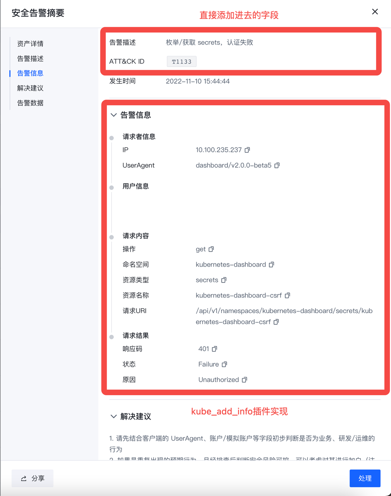

# K8S开源策略编写说明

## 数据源
K8S策略基于K8S Audit Logs数据，具体的Audit Policy可以在平台中下载。在Console中配置好后，数据会经Agent Center上开启的Webhook写入到Kafka的k8stopic。也可以直接使用HUB中自带的k8s INPUT作为数据源。
## 开源策略说明
### Project
在v1.9.1社区版中，我们编写了一部分示例策略用于开源，对应的HUB Project为kube_example和kube_workload。kube_example存放的策略为基础策略，kube_workload存放的为需要对数据进行处理后再进行检测的策略。
- kube_example
```
  INPUT.k8s --> RULESET.kube_detect
  RULESET.kube_detect --> RULESET.kube_alert_info
  RULESET.kube_alert_info --> RULESET.kube_add_cluster_info
  RULESET.kube_add_cluster_info --> RULESET.kube_push_alert
```
- kube_workload
```
  INPUT.k8s --> RULESET.kube_workloads
  RULESET.kube_workloads --> RULESET.kube_filter_workloads
  RULESET.kube_filter_workloads --> RULESET.kube_handle_workloads
  RULESET.kube_handle_workloads --> RULESET.kube_detect_workloads
  RULESET.kube_detect_workloads  --> RULESET.kube_alert_info
  RULESET.kube_alert_info --> RULESET.kube_add_cluster_info
  RULESET.kube_add_cluster_info --> RULESET.kube_push_alert
```
### Ruleset
下面为一些调用HUB内置插件的规则集进行补充说明，其余规则可以直接在HUB前端进行查看。

`kube_alert_info`规则集对检出的告警添加告警数据字段，同时调用Kube_add_info插件添加告警的基础信息。该插件为HUB内置Modify插件，因此可以按需调用。

`kube_add_cluster_info`规则集调用Manager接口通过集群id获取集群信息，该流程通过调用KubeAddClusterInfo插件实现。该插件为HUB内置Modify插件。

`kube_push_alert`规则集调用Manager接口推送告警，该流程通过调用KubePushMsgToLeader插件实现。该插件为HUB内置Action插件。

下图为告警内容说明：

workload相关检测策略通过Python Plugin进行实现，该插件于kube_handle_workloads中调用。
### 编写建议
在编写其余告警策略时，需要分别调用`kube_alert_info`、`kube_add_cluster_info`、`kube_push_alert`进行告警的信息填充，集群信息添加，告警的推送。如果新增告警类型，需要在`kube_alert_info`中进行添加，补充相关字段。