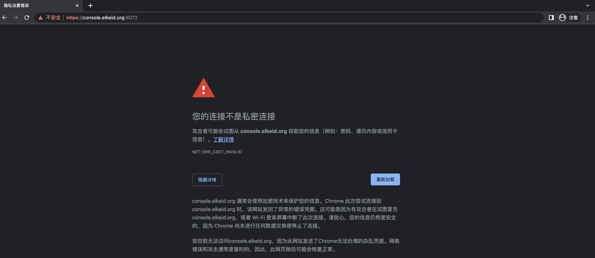
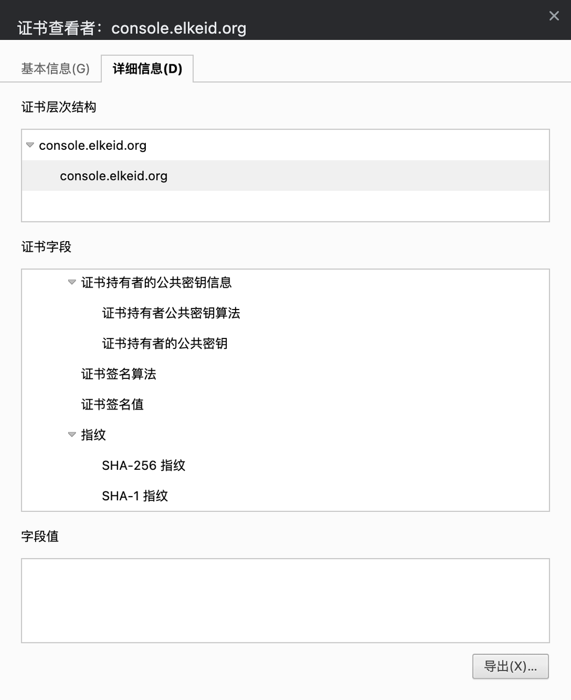
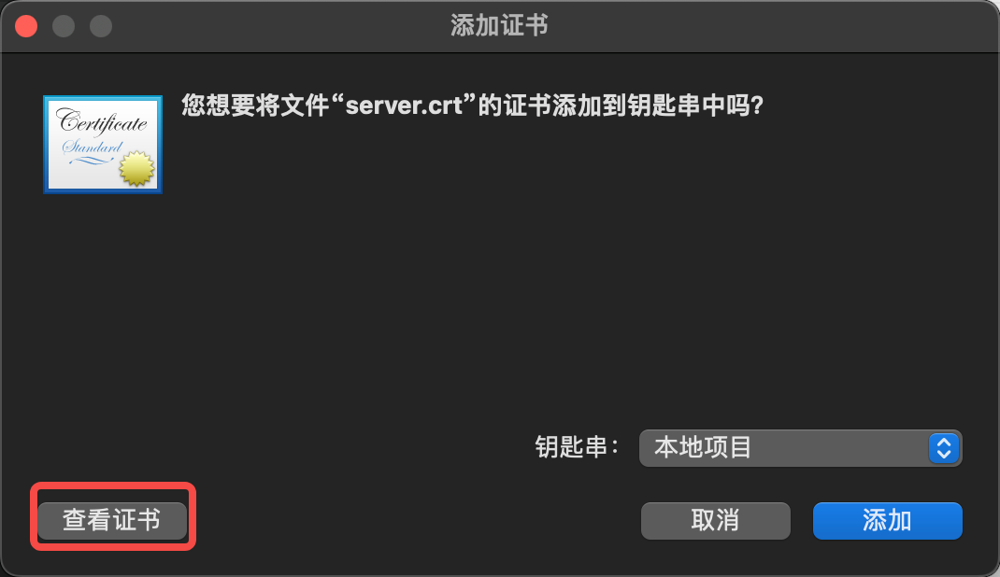
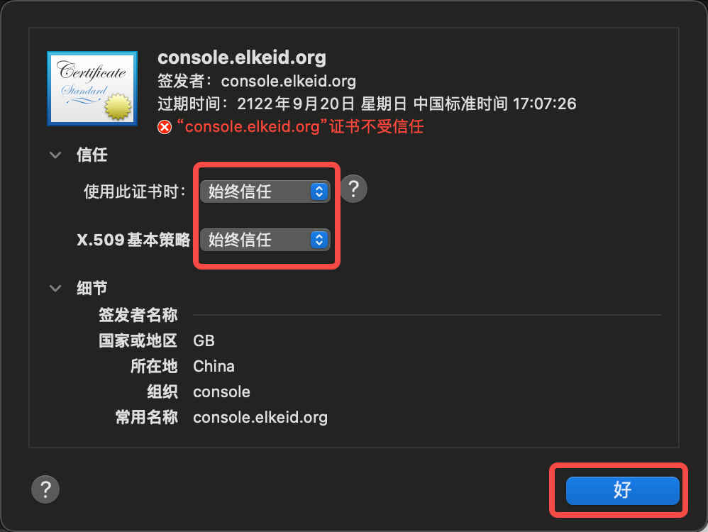
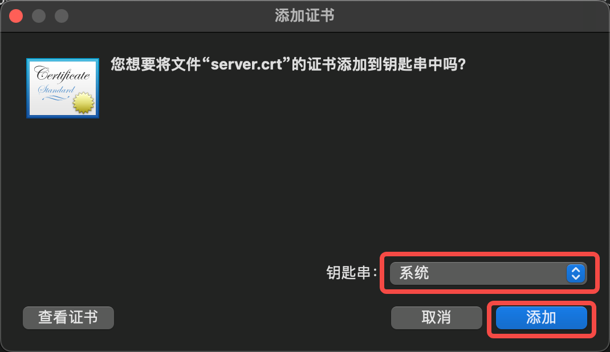
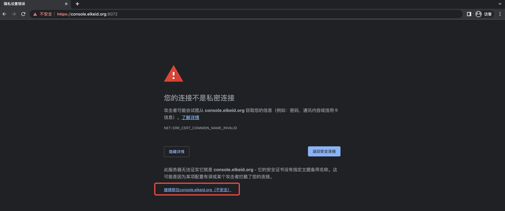
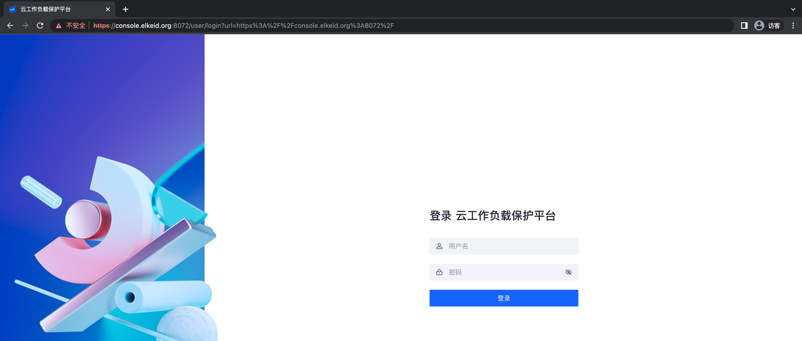

# Elkeid https配置文档

## 1 概述
- 默认情况下，Elkeid Console监听在8082和8072端口，Elkeid HUB监听在8081和8071端口。
- 如果需要使用HTTPS，可以使用8072和8071端口来访问。、

|       | Elkeid Console           | Elkeid HUB Console       |
|-------|--------------------------|--------------------------|
| HTTP  | http://{{NignxIP}}:8082  | http://{{NignxIP}}:8081  |
| HTTPS | https://{{NignxIP}}:8072 | https://{{NignxIP}}:8072 |

## 2、使用企业内部证书
安装时生成的自签名证书位于nginx所在机器的 `/elkeid/nginx/nginx` 目录，包括以下两个文件：
```
server.key
server.crt
```
替换上述两个文件后，执行以下操作即可：
```
chown -R nginx:nginx /elkeid/nginx
systemctl restart elkeid_nginx
```

## 3、使用部署时生成的自签名证书
Elkeid 在部署时，仅能使用自签名证书，由于chrome的安全设置，无法直接访问，所有需要手动信任该证书才可使用https访问，具体操作参考如下：
以下示例假设nginx所在服务器为 `console.elkeid.org`，并配置了`/etc/hosts`或dns解析。
### 3.1、Macos
1. 访问 `https://console.elkeid.org:8072/`  导出证书
   
   
2. 导入导出的证书并信任
   
   
   
3. 点击钥匙串访问，信任证书
   
4. 再次访问 `https://console.elkeid.org:8072/`
   
   