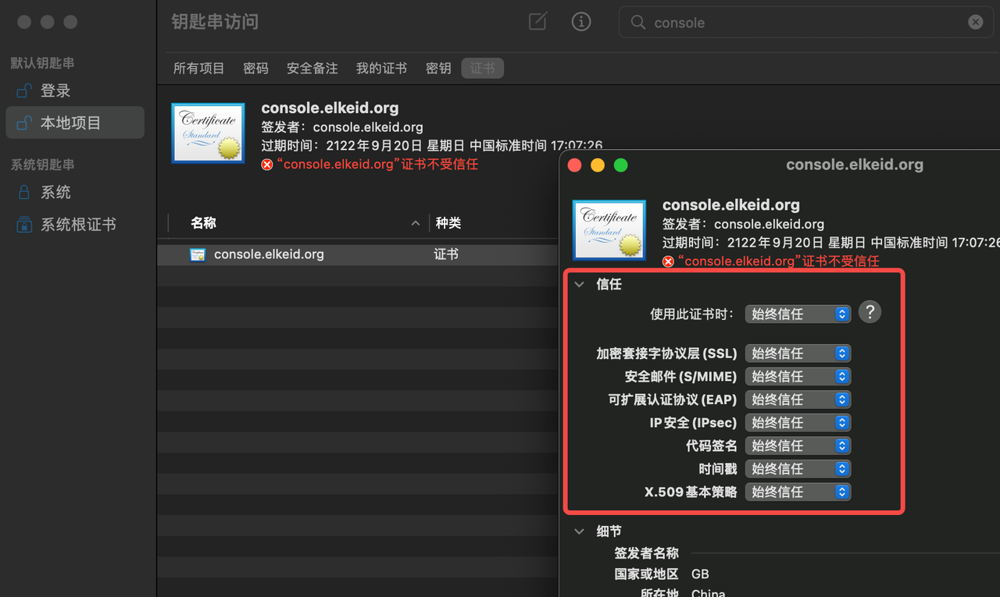

# Elkeid https configuration documentation

## 1. Overview
- By default, the Elkeid Console listens on ports 8082 and 8072, and the Elkeid HUB listens on ports 8081 and 8071.
- If HTTPS is required, ports 8072 and 8071 can be used for access.

|       | Elkeid Console           | Elkeid HUB Console       |
|-------|--------------------------|--------------------------|
| HTTP  | http://{{NignxIP}}:8082  | http://{{NignxIP}}:8081  |
| HTTPS | https://{{NignxIP}}:8072 | https://{{NignxIP}}:8072 |

## 2. Use an internal enterprise certificate
The self-signed certificate generated during installation is located in the '/elkeid/nginx/nginx' directory on the machine where nginx is located, and includes the following two files:
```
server.key
server.crt
```
After replacing the above two files, do the following:
```
chown -R nginx: nginx /elkeid/nginx
systemctl restart elkeid_nginx
```

## 3. Use the self-signed certificate generated at deployment time
When Elkeid is deployed, it can only use a self-signed certificate. Due to the security settings of chrome, it cannot be accessed directly. All you need to manually trust the certificate to access it using https. The specific operation is as follows:
The following example hypotheses that the server where nginx is located is `console.elkeid.org` and has a configuration of `/etc/hosts` or dns parsing.
### 3.1, Macos
1. Access https://console.elkeid.org:8072/ Export Certificate
   
   
2. Import the exported certificate and trust it
   
   
   
3. Click Keychain Access, Trust Certificate
   
4. Visit https://console.elkeid.org:8072/ again
   
   