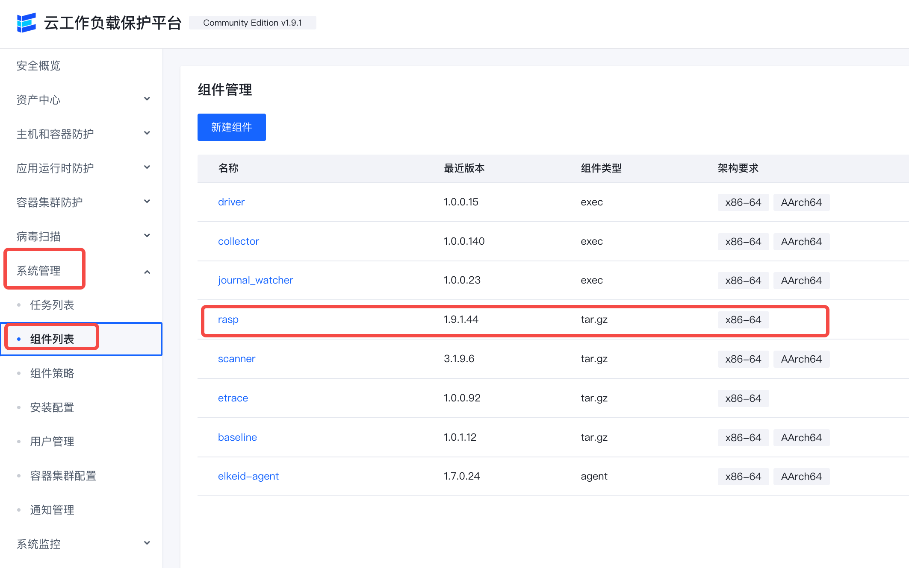
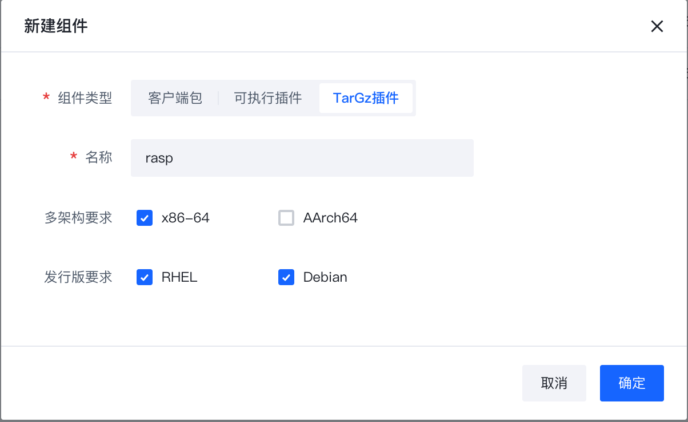
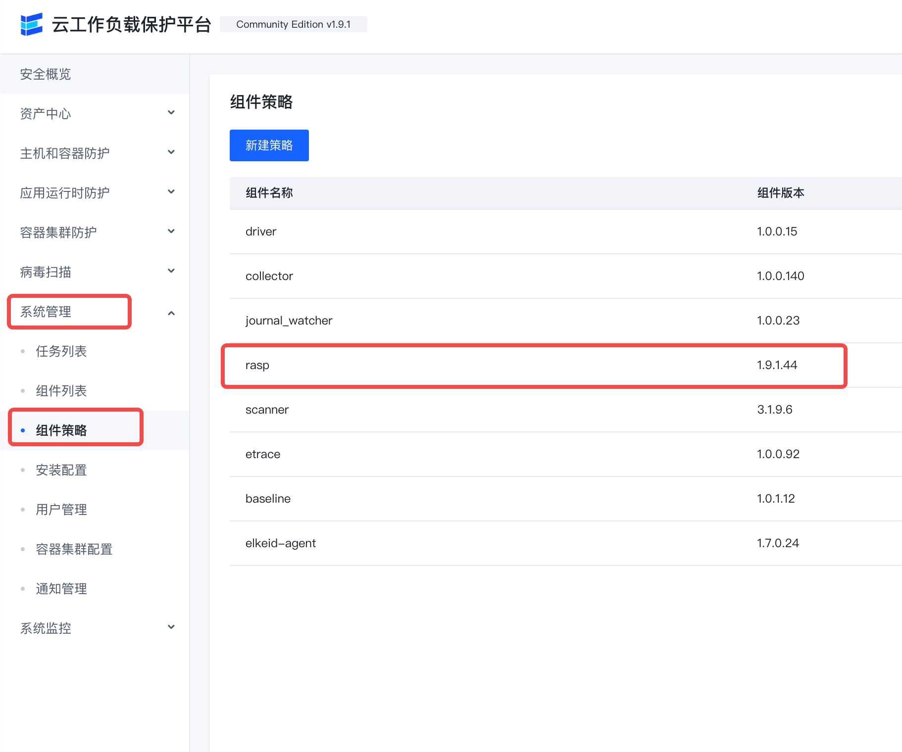
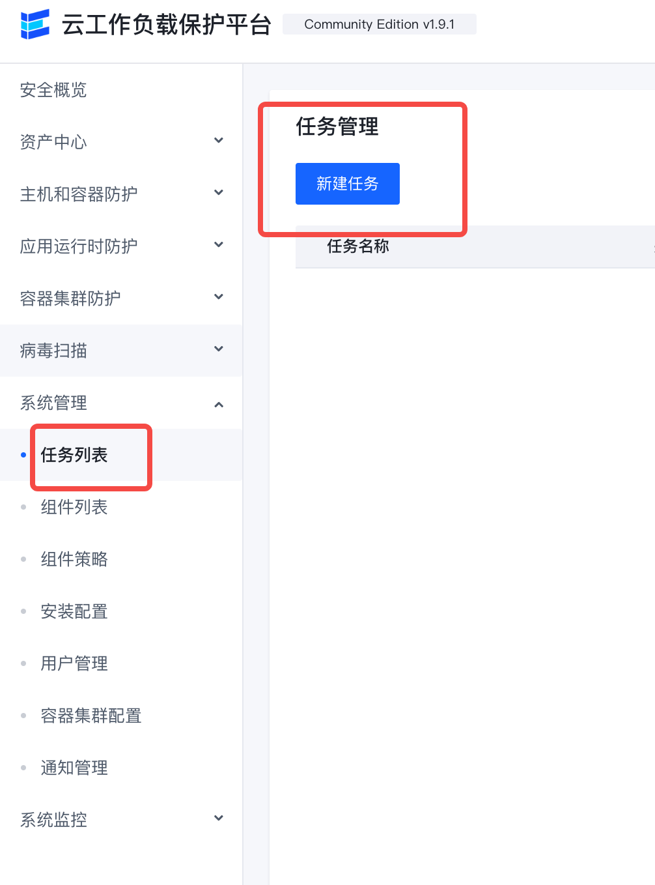
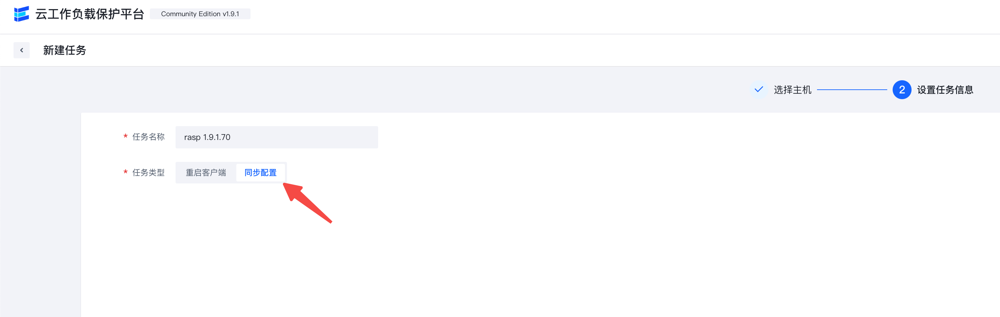
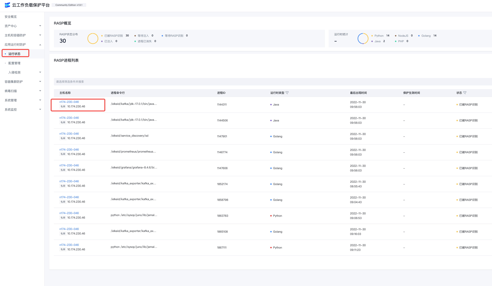
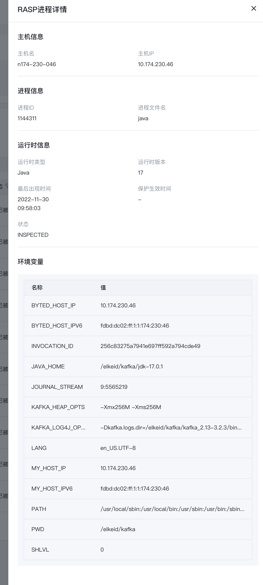
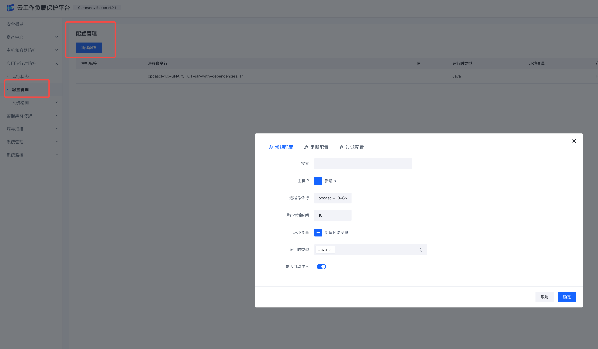
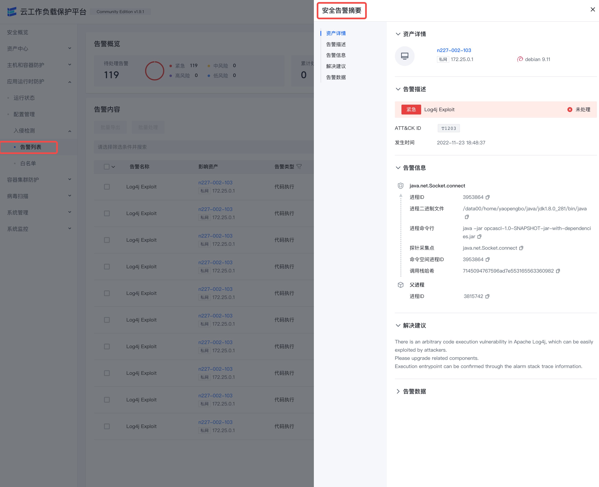
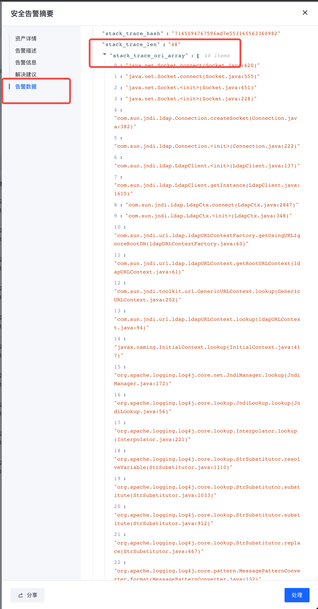

# Elkeid CWPP Application Runtime Protection (RASP) User Guide

> This guide covers the following features:
> - Operation and maintenance of application runtime components through CWPP.
> - Control the RASP implant probe into the target process to complete the runtime behavior acquisition.
> - Implant configuration
> - Blocking/Filtering, Configuration
> - View CWPP's alert events.

## Install/Update RASP Components

1. Make sure the rasp component is included in the component list.

If there is no rasp component, you need to create a new component named rasp.

> Note! Due to the Agent mechanism, the plugin name should be the same as the plugin binary name.

Publish the version and upload the compressed package in tar.gz format.
Please use the plugin version `1.9.1.*`.
Archive address: [bytedance/Elkeid: releases](https://github.com/bytedance/Elkeid/releases)

2. Make sure the RASP component is included in the component policy

3. Synchronize the policy to the machine.

## running state
After deploying the RASP component, RASP will automatically analyze the machine process, and the process information that meets the conditions for implantation of the probe will be reported to the running status.

Details link on the right Support viewing process Additional information

## Configure
Configure which processes will turn on RASP protection

Click New Configuration

The relationship between each form item of each configuration is AND
The relationship between each configuration is or

| Form Items | Required or Not | Meaning Explanation | Remarks |
|--------|--------|--------|----|
| Host Labels | No | Delineate the scope of applicable host labels for this configuration | Host labels are consistent with labels in Asset Management |
| IP | No | Match Machine IP | |
| Process command line | No | Regular matching of process command line | |
| environment variables | No | Match the environment variables of the process | Multiple environment variables can be the relationship between multiple environment variables |
| Runtime type | Yes | Which runtime is this configuration suitable for | Multiple selectable |
| Whether to enable injection | Yes | Whether to enable RASP protection for the process of configuring filtering in this article | Default is No |

Each configuration can also be configured with blocking and filtering
- Blocking: regular expression matching of a parameter of a Hook function
  - When the regular expression matches, the function throws an exception to block the function from running.
  - The function runs normally when the regular expression does not match.
- Filtering: regular expression matching of parameters of a Hook function
  - Contains: only report matched parameter data
  - does not contain: only report parameter data other than matching to

## Intrusion detection

After the RASP probe is implanted in the target process, it will continue to report application behavior, and events and alarms will be generated when abnormal behavior is found.

- The alarm data on the right can check parameter details and call stack

