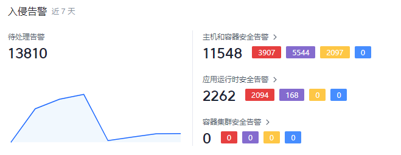
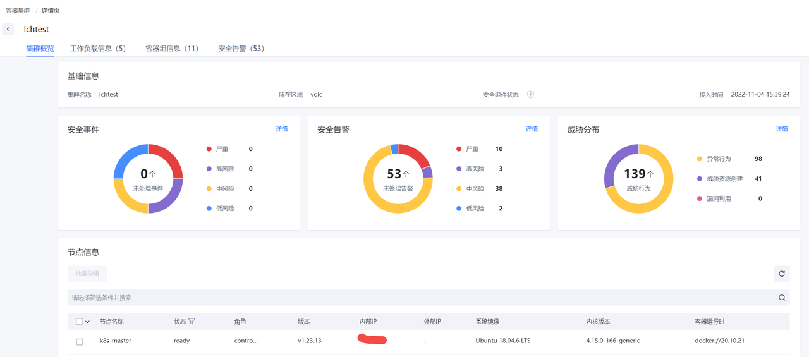
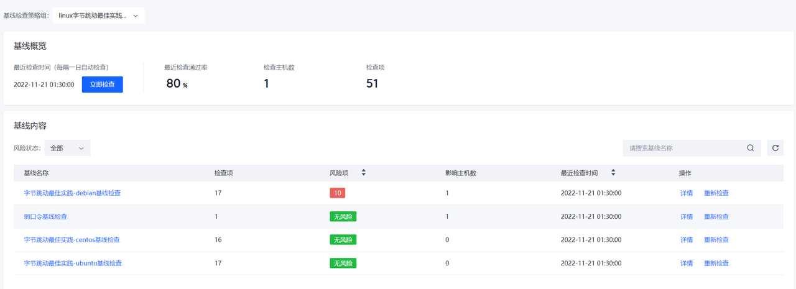
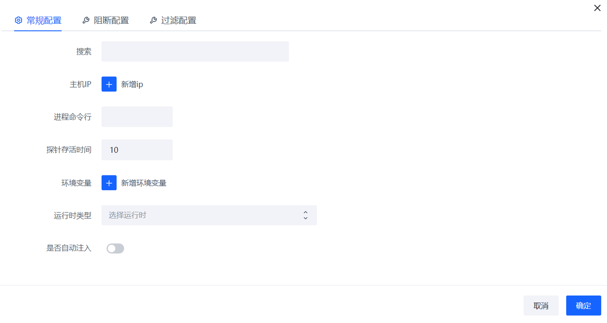

# Elkeid Console 主机安全保护平台使用手册

## 版本

社区版v1.9.1

## 安全概览

通过安全概览能快速了解覆盖范围，告警势态，运营情况(安全告警与安全风险处置情况)等的整体安全态势。

### 资产概览

查看当前在覆盖的主机和容器集群信息。

### 入侵告警

展示未处理告警的数量以及最近7天内的变化趋势。

### 漏洞风险

展示未处理漏洞的数量以及最近7天内的变化趋势。

### 基线风险

展示TOP3的基线风险数量。

### 主机风险分布

展示当前存在待处理告警、高可利用漏洞和基线风险的主机占比。

### Agent 概览

展示Agent的在线情况和资源占用情况。

### 后端服务状态

展示后端服务的负载。

## 资产中心

运营人员可以通过资产中心对资产数，Agent运行情况，资产上详细信息进行查看。

### 主机列表

展示主机资产的列表以及各主机的风险情况。

点击"主机名称"可以进入查看此主机的资产信息和风险信息。

点击页面中各标签可以查看主机各类相关数据，目前支持下列数据。

- 安全告警
- 漏洞风险
- 基线风险
- 运行时安全告警
- 病毒查杀
- 性能监控
- 资产指纹

### 资产指纹

通过该功能查看各主机的开放端口，运行进程，系统用户，定时任务，系统服务，系统软件等详情。

点击页面中各标签可以查看相应资产数据，目前支持下列资产数据:

- 容器
- 开放端口
- 运行进程
- 系统用户
- 定时任务
- 系统服务
- 系统软件
- 系统完整性校验
- 应用
- 内核模块

点击各行的"主机名称"可以跳转到相应主机的详情页，查看此主机资产指纹数据

### 容器集群

展示已经接入容器集群防护能力的容器集群信息。

## 主机和容器防护

### 入侵检测

#### 告警列表

告警列表可以查看当前环境内存在的安全告警列表。

点击"摘要"可以查看告警关键摘要信息。

点击”处理”可以进行告警的处理，目前处理操作支持"加白"，"已人工处理"和“误报”。

点击各行的“影响资产”可以跳转到关联的主机详情页面查看相关数据。

#### 白名单

主机和容器防护告警的白名单。

### 风险防范

#### 漏洞列表

漏洞列表页面可以查看当前环境内存在的安全漏洞风险，默认只显示高风险漏洞的信息，用户通过立即检查来检测环境中最新存在的安全漏洞。

在漏洞列表数据右侧点击详情可以查看漏洞信息以及影响的资产列表。

漏洞信息也可以通过处置与忽略进行标记。

#### 基线检查

基线检查页面可以查看当前环境内存在的安全基线风险，可以通过立即检查来查看环境中最新存在的安全基线问题。

在基线列表右侧点击详情可以看到相应的基线详情。

点击加白名单可以进行加白操作。

## 应用运行时安全防护

### 运行状态

展示运行时安全组件的覆盖情况。

### 配置管理

进行运行时安全组件的配置管理。

### 入侵检测

#### 告警列表

运行时安全检测发现的安全告警展示。

#### 白名单

运行时安全检测告警过滤白名单规则展示。

## 容器集群防护

### 入侵检测

#### 告警列表

容器集群防护发现的安全告警展示。

#### 白名单

容器集群防护告警过滤白名单规则展示。

## 病毒扫描

### 病毒扫描

显示检测到的病毒文件信息。

### 白名单

对病毒检测结果进行过滤的白名单列表。

## 系统管理

### 任务管理

该功能主要用于重启客户端、同步配置等管理。

点击”新建任务“，可以进行任务的配置。

除"重启客户端"类型任务外，其他类型任务需要先在"组件管理"和"组件策略"界面进行Agent和插件的配置，才能进行相应操作。 

### 组件管理

用于对Agent和相应插件进行升级配置的管理。

点击”新建组件“可以选择组件的类型是Agent还是插件，然后进行相应配置。

点击发布版本按钮，可以通过上传对应架构与发行版的组件文件生成版本实例。

### 组件策略

通过管理组件策略，调整Agent实际生效的组件版本，进而实现更新、卸载等操作。

点击新建策略，通过选择组件名称及相匹配的版本，将对应策略添加至策略组中。

通过屏蔽规则使得部分主机不加载(生效)对应组件。

### 安装配置

可以通过部署帮助来实现Agent的部署和卸载。

### 用户管理

可以在用户管理中对Elkeid Console进行管理，如修改密码，新增与删除用户。

点击"新增用户"可以设置增加新的用户，设置密码的时候请注意密码强度的要求。

### 容器集群配置

进行容器集群防护能力接入的配置。

### 通知管理

告警通知以及过期通知的配置管理，支持飞书，钉钉等。

## 系统监控

### 后端监控

查看后端服务所在主机的CPU，内存，磁盘和网络流量等使用情况。

### 后端服务

查看后端各服务模块的QPS，CPU和内存的使用情况。

### 服务告警

显示最近1小时/24小时发现的服务异常告警。

